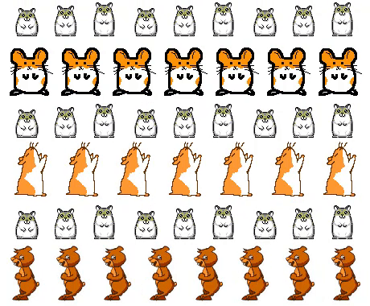

# Generate memes
This program generates hamster memes, and lets you generate memes.

# Project
This is a project from [Udacity's](https://www.udacity.com/) 'Intermediate Python' course. 

# Command line 

You can either get a random hamster meme with some wise words in it, without providing arguments. Or you can provide a path to an image with `--path`, a meme text with `--body` and a meme author with `--author` to make your own meme. The command returns the path to the meme.

## get help
`python meme.py --help`

### random hamster meme
`python meme.py`

### create your own meme
`python meme.py --path _data/photos/hamster/hamster1.jpeg --body "I don't believe in reincarnation, and I didn't believe in it when I was a hamster." --author "Unknown ex-hamster"`

## Flask app
`python app.py --help`

This creates a flask app in your browser, which makes the meme generator very easy to use.
